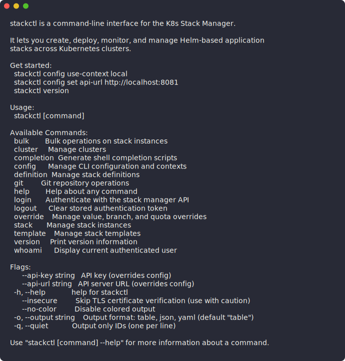
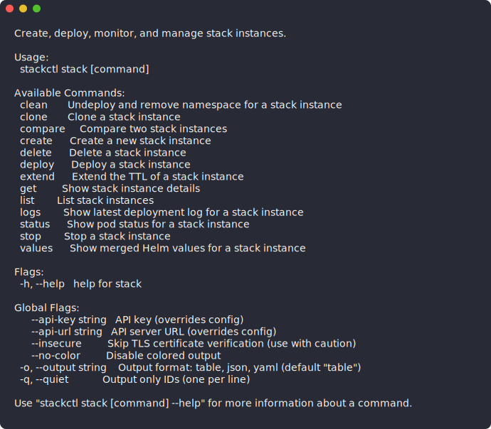

# stackctl

Command-line interface for [K8s Stack Manager](https://github.com/omattsson/k8s-stack-manager) — create, deploy, monitor, and manage Helm-based application stacks across Kubernetes clusters.

<p align="center">
  
</p>

## Installation

### From source

```bash
git clone https://github.com/omattsson/stackctl.git
cd stackctl/cli
go build -o bin/stackctl .
sudo cp bin/stackctl /usr/local/bin/
```

### Go install

```bash
go install github.com/omattsson/stackctl/cli@latest
```

### From release binaries

Download the latest binary for your platform from [Releases](https://github.com/omattsson/stackctl/releases), then:

```bash
chmod +x stackctl-*
sudo mv stackctl-* /usr/local/bin/stackctl
```

## Quick Start

```bash
# 1. Configure a context
stackctl config use-context local
stackctl config set api-url http://localhost:8081

# 2. Verify your setup
stackctl version
stackctl config list

# 3. Authenticate
stackctl login

# 4. Browse templates and deploy
stackctl template list
stackctl template quick-deploy 1
stackctl stack list --mine
```

## Extending — add your own subcommands

Drop an executable named `stackctl-<name>` anywhere on your `$PATH` and it becomes `stackctl <name>` automatically. No plugin SDK, no recompile, no changes to stackctl itself. Same pattern as `git`, `kubectl`, and `gh`.

Because the contract is "any executable with the right name", plugins can be written in any language (shell, Python, Go, Node, Rust, …) and shipped however your team already distributes binaries.

Quick example:

```bash
cat > ~/.local/bin/stackctl-hello <<'EOF'
#!/usr/bin/env bash
echo "Hello! API=${STACKCTL_API_URL} args=$*"
EOF
chmod +x ~/.local/bin/stackctl-hello

stackctl hello world     # → Hello! API=http://... args=world
stackctl --help | grep hello
# hello    Plugin: hello
```

The plugin inherits the user's full environment. If `STACKCTL_API_URL` and `STACKCTL_API_KEY` are exported in your shell, the plugin sees them. Values saved with `stackctl config set` are **not** automatically exported — export them yourself (`export STACKCTL_API_URL="$(stackctl config get api-url)"`) or see [EXTENDING.md](EXTENDING.md) for the full story. Built-in subcommands always win on name collisions (a safety feature — a malicious `stackctl-config` on PATH can't intercept credentials).

👉 **[Full guide: EXTENDING.md](EXTENDING.md)** — tutorial, recipes in bash/Python/Go, best practices, and how plugins pair with [server-side action webhooks](https://github.com/omattsson/k8s-stack-manager/blob/main/EXTENDING.md) for end-to-end custom operations.

## Configuration

stackctl uses named contexts to manage multiple environments. Configuration is stored in `~/.stackmanager/config.yaml`.

### Contexts

```bash
# Create and switch to a context
stackctl config use-context local
stackctl config set api-url http://localhost:8081

# Add a production context
stackctl config use-context production
stackctl config set api-url https://stackmanager.example.com
stackctl config set api-key sk_prod_...

# Switch between contexts
stackctl config use-context local

# Show current context
stackctl config current-context

# List all contexts
stackctl config list

# Delete a context
stackctl config delete-context staging
```

### Authentication

stackctl supports two authentication methods:

- **JWT token** — `stackctl login` prompts for credentials and stores the token in `~/.stackmanager/tokens/<context>.json`
- **API key** — `stackctl config set api-key sk_...` for non-interactive / CI use

API key takes precedence when both are configured.

### Precedence

Configuration values are resolved in this order (highest priority first):

1. Command-line flags (`--api-url`, `--api-key`)
2. Environment variables (`STACKCTL_API_URL`, `STACKCTL_API_KEY`)
3. Config file (`~/.stackmanager/config.yaml`)

## Usage

### Stack Instances

<p align="center">
  
</p>

All stack commands accept a **name or ID** — e.g. `stackctl stack deploy my-app` or `stackctl stack deploy 42`.

```bash
# List instances
stackctl stack list
stackctl stack list --mine --status running
stackctl stack list --cluster 1 -o json

# Create and deploy
stackctl stack create --definition 1 --name my-app --branch feature/xyz --ttl 480
stackctl stack deploy my-app

# Monitor
stackctl stack status my-app
stackctl stack logs my-app

# Lifecycle
stackctl stack stop my-app
stackctl stack clean my-app
stackctl stack delete my-app

# Clone an existing instance
stackctl stack clone my-app

# Extend TTL
stackctl stack extend my-app --minutes 120

# Deployment history and rollback
stackctl stack history my-app
stackctl stack history-values my-app <log-id>
stackctl stack rollback my-app --target <log-id>
```

### Templates

```bash
# Browse published templates
stackctl template list --published
stackctl template get 1

# Deploy from template (one command)
stackctl template quick-deploy 1

# Or step by step
stackctl template instantiate 1 --name my-stack --branch main

# Delete a template
stackctl template delete 1
```

### Stack Definitions

```bash
# List and inspect
stackctl definition list --mine
stackctl definition get 5

# Create from file
stackctl definition create --from-file definition.json

# Update metadata
stackctl definition update 5 --name new-name
stackctl definition update 5 --branch develop
stackctl definition update 5 --description "Updated description"

# Update a chart config (GET-merge-PUT preserves unspecified fields)
stackctl definition update-chart 5 1 --chart-version 0.3.0
stackctl definition update-chart 5 1 --chart-path /charts/kvk-core
stackctl definition update-chart 5 1 --deploy-order 6
stackctl definition update-chart 5 1 --file values.yaml

# Delete
stackctl definition delete 5

# Export / import
stackctl definition export 5 > backup.json
stackctl definition import --file backup.json
```

### Value and Branch Overrides

```bash
# Set Helm value overrides from a file
stackctl override set 42 3 --file values.yaml

# Set individual values
stackctl override set 42 3 --set image.tag=v2.0.0

# Per-chart branch overrides
stackctl override branch set 42 3 feature/hotfix

# Quota overrides
stackctl override quota get 42
stackctl override quota set 42 --cpu 4 --memory 8Gi
stackctl override quota delete 42

# View merged values
stackctl stack values 42
stackctl stack values 42 --chart 3

# Compare two instances side by side
stackctl stack compare 42 43
```

### Bulk Operations

Bulk commands accept **names or IDs** (up to 50 at a time).

```bash
# Bulk deploy/stop/clean/delete
stackctl bulk deploy --ids my-app,other-app,3
stackctl bulk deploy my-app other-app 3   # positional args also work
stackctl bulk stop --ids 1,2,3
stackctl bulk clean --ids 1,2,3

# Piping workflows with quiet mode
stackctl stack list --status stopped --mine -q | xargs stackctl bulk deploy
```

### Orphaned Namespaces

Manage Kubernetes namespaces that have the stack-manager label but no matching database record.

```bash
# List orphaned namespaces
stackctl orphaned list
stackctl orphaned list -o json

# Delete an orphaned namespace
stackctl orphaned delete stack-old-namespace
```

### Scripting Examples

```bash
# Deploy all stopped stacks owned by me
stackctl stack list --status stopped --mine -q | xargs stackctl bulk deploy

# Export all definitions to individual files
for id in $(stackctl definition list -q); do
  stackctl definition export "$id" -o json > "definition-${id}.json"
done

# CI/CD: deploy and wait for status
stackctl stack deploy 42
while [ "$(stackctl stack status 42 -o json | jq -r '.status')" != "running" ]; do
  sleep 5
done
echo "Stack 42 is running"

# Delete all stacks on a specific cluster
stackctl stack list --cluster 1 -q | xargs stackctl bulk delete --yes
```

### Clusters

```bash
stackctl cluster list
stackctl cluster get 1
```

### Git

```bash
stackctl git branches --repo https://dev.azure.com/org/project/_git/repo
stackctl git validate --repo https://dev.azure.com/org/project/_git/repo --branch main
```

## Output Formats

Most commands support multiple output formats via the `--output` flag:

```bash
# Table (default) — human-readable with colored status badges
stackctl stack list

# JSON — machine-readable, full API response
stackctl stack list -o json

# YAML — machine-readable
stackctl stack list -o yaml

# Quiet — IDs only, one per line (for piping)
stackctl stack list -q
```

## Global Flags

| Flag | Short | Description |
|------|-------|-------------|
| `--output` | `-o` | Output format: `table`, `json`, `yaml` |
| `--quiet` | `-q` | Output only IDs (one per line) |
| `--no-color` | | Disable colored output |
| `--api-url` | | Override API server URL |
| `--api-key` | | Override API key |
| `--insecure` | | Skip TLS certificate verification |
| `--help` | `-h` | Show help |

## Shell Completion

```bash
# Bash
stackctl completion bash > /etc/bash_completion.d/stackctl

# Zsh
stackctl completion zsh > "${fpath[1]}/_stackctl"

# Fish
stackctl completion fish > ~/.config/fish/completions/stackctl.fish
```

## Contributing

### Prerequisites

- Go 1.26+
- A running [k8s-stack-manager](https://github.com/omattsson/k8s-stack-manager) backend for integration/e2e tests (`make dev` in that repo)

### Getting Started

```bash
git clone https://github.com/omattsson/stackctl.git
cd stackctl/cli
go mod tidy
go build -o bin/stackctl .
```

### Project Structure

```
cli/
  main.go                 # Entry point
  cmd/                    # Cobra commands (one file per command group)
    config.go             # config set/get/list/use-context/current-context/delete-context
    login.go              # login, logout, whoami
    stack.go              # stack lifecycle (create, deploy, stop, clean, delete, clone, extend, status, logs, history, rollback, compare, values)
    template.go           # template list/get/instantiate/quick-deploy/delete
    definition.go         # definition CRUD + export/import + update-chart
    override.go           # value, branch, and quota overrides
    orphaned.go           # orphaned namespace list/delete
    bulk.go               # bulk deploy/stop/clean/delete (names or IDs)
    resolve.go            # name/ID resolution helpers
    git.go                # git branches/validate
    cluster.go            # cluster list/get
    completion.go         # shell completion (bash/zsh/fish/powershell)
  pkg/
    client/               # HTTP client (auth, error handling)
    config/               # Config file management (named contexts)
    output/               # Table, JSON, YAML, quiet formatters
    types/                # Client-side structs matching API responses
  test/
    integration/          # Filesystem-based integration tests
    e2e/                  # Binary execution end-to-end tests
```

### Development Workflow

```bash
# Run all tests
cd cli
go test ./... -v

# Run only unit tests (skip integration/e2e)
go test ./... -v -short

# Run a specific test package
go test ./pkg/client/ -v

# Check coverage
go test ./pkg/... ./cmd/ -coverprofile=coverage.out
go tool cover -func=coverage.out

# Lint
go vet ./...
```

### Writing Tests

- **Unit tests** go next to the code they test (`foo_test.go` alongside `foo.go`)
- **Integration tests** go in `test/integration/` — skipped with `-short`
- **E2E tests** go in `test/e2e/` — build and run the actual binary, skipped with `-short`
- Use `testify/assert` and `testify/require`
- Table-driven tests with `t.Parallel()` where possible (not with `t.Setenv`)
- Mock HTTP servers (`httptest.NewServer`) for client tests — never call a real API in unit tests
- Target 80%+ coverage on `pkg/` packages

### Adding a New Command

1. Add types to `pkg/types/types.go` if the API returns new structs
2. Add client methods to `pkg/client/client.go`
3. Create a command file in `cmd/` with `Use`, `Short`, `Long`, `RunE`
4. Register flags and add to the parent command in `init()`
5. Use `pkg/output` for all formatted output
6. Write tests covering success, error, and output format cases

### Pull Request Guidelines

- Branch from `main` with a descriptive name (e.g., `feature/stack-commands`, `fix/token-expiry`)
- Include tests for new functionality
- Run `go test ./... -v` and `go vet ./...` before pushing
- Keep PRs focused — one feature or fix per PR
- Reference the relevant GitHub issue in the PR description (e.g., `Closes #3`)

## License

See [LICENSE](LICENSE) for details.
