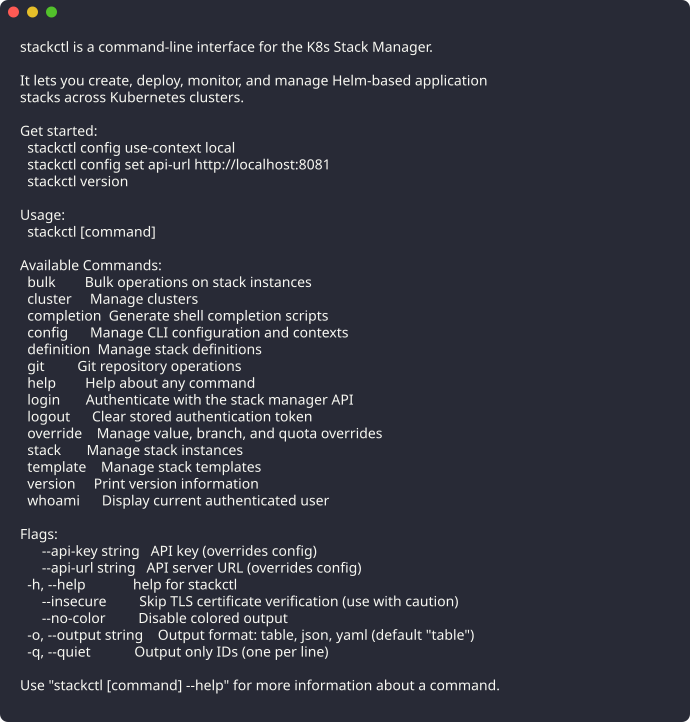
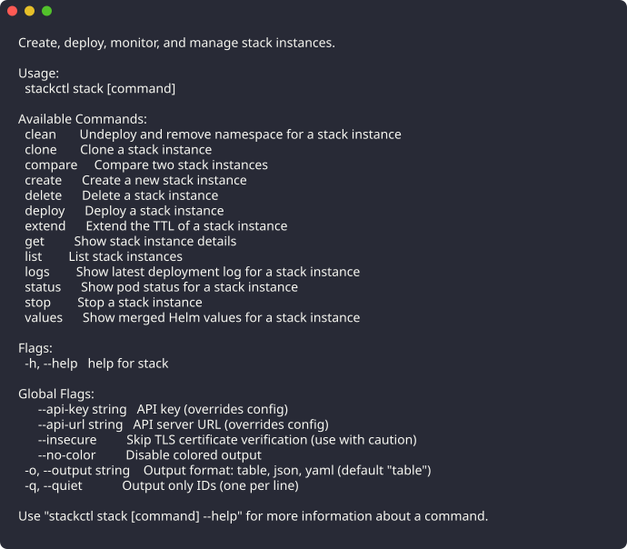

# stackctl

Command-line interface for [K8s Stack Manager](https://github.com/omattsson/k8s-stack-manager) — create, deploy, monitor, and manage Helm-based application stacks across Kubernetes clusters.

<p align="center">
  
</p>

## Installation

### Quick install (Linux / macOS)

```bash
curl -fsSL https://raw.githubusercontent.com/omattsson/stackctl/main/install.sh | sudo bash
```

### Homebrew (macOS / Linux)

```bash
brew install --cask omattsson/tap/stackctl
```

No compiler is needed. The cask removes the macOS quarantine attribute from the binary, because the binary is not signed or notarized. The cask needs Homebrew 6.0.13 or later (`brew update`).

If you installed the old formula, remove it once before the first cask install:

```bash
brew uninstall --formula stackctl && brew install --cask omattsson/tap/stackctl
```

Homebrew installs stable releases only. To install a release candidate (for example `v0.7.0-rc.1`), use the release binaries below.

### From release binaries

Download the latest binary for your platform from [Releases](https://github.com/omattsson/stackctl/releases), then:

```bash
tar -xzf stackctl_*.tar.gz
sudo install -m 755 stackctl /usr/local/bin/stackctl
```

Release candidates (for example `v0.7.0-rc.1`) are GitHub pre-releases. They are not "Latest", and the quick install script and Homebrew do not install them. Download the archive from the release page of the tag, for example `https://github.com/omattsson/stackctl/releases/tag/v0.7.0-rc.1`. On macOS, remove the quarantine attribute before the first run: `xattr -d com.apple.quarantine stackctl`.

### From source

```bash
git clone https://github.com/omattsson/stackctl.git
cd stackctl/cli
go build -o bin/stackctl .
sudo cp bin/stackctl /usr/local/bin/
```

## Quick Start

```bash
# 1. Configure a context
stackctl config use-context local
stackctl config set api-url http://localhost:8081

# 2. Verify your setup
stackctl version
stackctl config list

# 3. Authenticate
stackctl login

# 4. Browse templates and deploy
stackctl template list
stackctl template quick-deploy 8c9d0e1f-2a3b-4c5d-9e6f-7a8b9c0d1e2f
stackctl stack list --mine
```

## Extending — add your own subcommands

Drop an executable named `stackctl-<name>` anywhere on your `$PATH` and it becomes `stackctl <name>` automatically. No plugin SDK, no recompile, no changes to stackctl itself. Same pattern as `git`, `kubectl`, and `gh`.

Because the contract is "any executable with the right name", plugins can be written in any language (shell, Python, Go, Node, Rust, …) and shipped however your team already distributes binaries.

Quick example:

```bash
cat > ~/.local/bin/stackctl-hello <<'EOF'
#!/usr/bin/env bash
echo "Hello! API=${STACKCTL_API_URL} args=$*"
EOF
chmod +x ~/.local/bin/stackctl-hello

stackctl hello world     # → Hello! API=http://... args=world
stackctl --help | grep hello
# hello    Plugin: hello
```

The plugin inherits the user's full environment. stackctl also sets the effective settings of the current context and of the global flags as environment variables: `STACKCTL_API_URL`, `STACKCTL_API_KEY` or `STACKCTL_TOKEN`, `STACKCTL_CONTEXT`, `STACKCTL_INSECURE`, `STACKCTL_CONFIG_DIR`, and with the flag `STACKCTL_OUTPUT`, `STACKCTL_QUIET`, `STACKCTL_NO_COLOR` (and `NO_COLOR`), `STACKCTL_DEBUG`. Put the global flags before the plugin name: `stackctl --no-color -o json refresh-db status my-stack` gives the plugin the arguments `status my-stack` and the flag values in the environment. Arguments after the plugin name go to the plugin unchanged. See [EXTENDING.md](EXTENDING.md#what-plugins-receive) for the full contract. Built-in subcommands always win on name collisions (a safety feature — a malicious `stackctl-config` on PATH can't intercept credentials).

👉 **[Full guide: EXTENDING.md](EXTENDING.md)** — tutorial, recipes in bash/Python/Go, best practices, and how plugins pair with [server-side action webhooks](https://github.com/omattsson/k8s-stack-manager/blob/main/EXTENDING.md) for end-to-end custom operations.

## Configuration

stackctl uses named contexts to manage multiple environments. Configuration is stored in `~/.stackmanager/config.yaml`.

### Contexts

```bash
# Create and switch to a context
stackctl config use-context local
stackctl config set api-url http://localhost:8081

# Add a production context
stackctl config use-context production
stackctl config set api-url https://stackmanager.example.com
stackctl config set api-key sk_prod_...

# Switch between contexts
stackctl config use-context local

# Show current context
stackctl config current-context

# List all contexts
stackctl config list

# Delete a context
stackctl config delete-context staging
```

### Authentication

stackctl supports two authentication methods:

- **JWT token** — `stackctl login` prompts for credentials and stores the token in `~/.stackmanager/tokens/<context>.json`
- **API key** — `stackctl config set api-key sk_...` for non-interactive / CI use

API key takes precedence when both are configured.

#### Session renewal

The server gives a username/password login a short-lived access token (15 minutes by default) and a refresh token. `stackctl login` stores both in the token file (mode `0600`). stackctl renews the access token automatically:

- before a request, when the access token expires within 60 seconds;
- after a `401` response, once, and then it retries the request once;
- before it starts a plugin, so the plugin gets a valid `STACKCTL_TOKEN`.

Renewal works until the session ends: 12 hours after the login, or after 30 minutes without use (server defaults). Then stackctl removes the stored token and shows `Not authenticated. Run 'stackctl login' first.` A network or server error during renewal keeps the stored token.

The server rotates the refresh token on each renewal. stackctl holds a lock on `tokens/<context>.lock` during a renewal, so parallel stackctl commands renew only once.

An SSO login (`stackctl login --sso`) gets a longer-lived token (24 hours by default) without a refresh token. It is not renewed. API keys have no session.

`stackctl logout` sends the access token and the refresh token to the server, which ends the session, and then removes the token file. If the server cannot be reached, stackctl prints a warning and still removes the file.

### Precedence

Configuration values are resolved in this order (highest priority first):

1. Command-line flags (`--api-url`, `--api-key`)
2. Environment variables (`STACKCTL_API_URL`, `STACKCTL_API_KEY`)
3. Config file (`~/.stackmanager/config.yaml`)

## Usage

### Stack Instances

<p align="center">
  
</p>

All stack commands accept a **name or ID** — e.g. `stackctl stack deploy my-app` or `stackctl stack deploy 6a1d2c3b-4e5f-4a6b-8c7d-9e0f1a2b3c4d`.

```bash
# List instances
stackctl stack list
stackctl stack list --mine --status running
stackctl stack list --cluster 5b6c7d8e-9f0a-4b1c-8d2e-3f4a5b6c7d8e -o json

# Create and deploy
stackctl stack create --definition example-dev --name my-app --branch feature/xyz --ttl 480
stackctl stack deploy my-app

# Monitor
stackctl stack status my-app
stackctl stack logs my-app
stackctl stack watch --id 6a1d2c3b-4e5f-4a6b-8c7d-9e0f1a2b3c4d

# Lifecycle
stackctl stack stop my-app
stackctl stack clean my-app
stackctl stack delete my-app

# Clone an existing instance
stackctl stack clone my-app

# Add 120 minutes to the stack's expiry (never shortens it); prints the old and the new expiry
stackctl stack extend my-app --minutes 120

# Deployment history and rollback
stackctl stack history my-app
stackctl stack history-values my-app <log-id>
stackctl stack rollback my-app --target-log <log-id>
```

`stack rollback --target-log` does not change the stored overrides. When the stored overrides produce other values than the target deploy, the server sets `values_drift` and stackctl writes a warning to stderr: the next deploy applies the stored overrides again. `stack get` writes the same warning while the drift exists; `-o json` and `-o yaml` include `values_drift` and `warning`. `stack rollback -o json|yaml` prints the rollback response, with `values_drift` and `warning`. `stack clone` writes the server warning to stderr when the quota override of the source is not copied, for example because it is above the cluster quota (k8s-stack-manager v0.7.0 or later).

`stack list`, `stack get`, `definition list/get` and `template get` show the owner, cluster and definition names when the server sends them (`owner_username`, `cluster_name`, `definition_name`; k8s-stack-manager v0.7.0 or later, server issue #470). Otherwise they show the IDs. The `stack get` table shows `Cluster` and `Definition` (before: `Cluster ID` and `Definition ID`) as "name (id)" or the ID.

`stack extend --minutes N` adds N minutes to the current expiry, or to now when the stack has expired. It never makes the expiry earlier and does not change the TTL of the stack. The server caps the new expiry at 30 days from now. `--minutes` needs k8s-stack-manager v0.6.0 or later. An older server ignores `--minutes` and resets the expiry to now + TTL. stackctl detects this: it prints the old and the new expiry, then fails (exit code 1) with "the server did not add N minutes ... upgrade k8s-stack-manager to v0.6.0 or later". `--reset-ttl M` (deprecated) keeps the old behaviour: the TTL becomes M minutes and the expiry now + M minutes, which can be earlier. `--yes` has no effect and is accepted for older scripts.

List commands (`stack list`, `definition list`, `template list`) show one page: 25 items by default, `--page-size` up to 100. When the server has more items, the command writes `Showing X of TOTAL. Use --page/--page-size to see more.` to stderr, so `-q` and `-o json` output stays clean. `-q` without `--page` prints the IDs of all pages, so `stackctl stack list --mine -q | xargs ...` gets every ID. k8s-stack-manager v0.7.0 also pages `--mine` and name queries; older servers return every match on one page. When a name matches more than one stack or definition, the error lists the first page and the number of matches.

`stack deploy`, `stop`, `clean` and `rollback` with `--follow` (`-f`), and `stack watch --id`, wait for a terminal status: `running`, `stopped` or `draft` (exit code 0), or `error` or `partial` (exit code 1). `partial` means that some charts deployed and others failed; the message names the operation, the status and the server error, for example `deploy partially failed (status partial): some charts did not deploy: ...`. `--follow` reads the instance after it connects, so an operation that ended before the connection counts. It handles a server close like `stack watch`: after `token expired` it renews the session, connects again and reads the instance, so a final status during the reconnect counts. When `--follow` cannot follow the operation to the end (session revoked, SSO login without refresh token, failed renewal, lost connection), it exits with code 1 and says that the operation continues on the server. Do not start the operation again: run `stackctl stack watch --id <id>` or `stackctl stack status <id>`.

`stack watch` stops with a non-zero exit code when the server closes the WebSocket connection with close code 1008. It writes the reason to stderr:

- `session revoked`: the server ended the session after a delete, a disable, a password reset or a role change of the user, or after a logout or logout-all. The message is `Connection closed by the server: session revoked. Log in again.`
- `token expired`: the access token expired. With a username/password login, the watch renews the token and connects again, at most once in 30 seconds. With `--id` it then reads the status of each pending instance, so a terminal status during the reconnect is not lost. An SSO login has no refresh token, so the watch stops: run the command again, and run `stackctl login` if it fails. A failed renewal also stops the watch.

A long watch can end at the idle limit of the session (server setting `SESSION_IDLE_TIMEOUT`, 30 minutes by default), because WebSocket traffic and token renewal do not count as activity. Then the renewal fails and the watch stops.

With `--id`, a connection that ends for another reason before every listed instance reaches a terminal status stops the watch with `connection lost before all instances reached a terminal status` and a non-zero exit code. The watch does not reconnect, because a missed terminal event would make it wait forever. Without `--id`, a lost connection writes a note to stderr and the exit code is 0.

stackctl writes any `Warning` header from the API (for example a deprecation notice) to stderr as `Warning: <text>`, for every command.

### Templates

```bash
# Browse published templates
stackctl template list --published
stackctl template get 8c9d0e1f-2a3b-4c5d-9e6f-7a8b9c0d1e2f

# Deploy from template (one command)
stackctl template quick-deploy 8c9d0e1f-2a3b-4c5d-9e6f-7a8b9c0d1e2f

# Or step by step
stackctl template instantiate 8c9d0e1f-2a3b-4c5d-9e6f-7a8b9c0d1e2f --name my-stack --branch main

# Create a template with a version, update the working copy (GET-then-PUT keeps other fields)
stackctl template create --name my-template --version 1.0.0
stackctl template update 8c9d0e1f-2a3b-4c5d-9e6f-7a8b9c0d1e2f --description "Web stack" --version 1.1.0

# Update a chart config in a template (GET-merge-PUT preserves unspecified fields)
stackctl template update-chart 8c9d0e1f-2a3b-4c5d-9e6f-7a8b9c0d1e2f 3f2b8c1e-5a4d-4e6f-9a7b-1c2d3e4f5a6b --chart-version 0.3.7
stackctl template update-chart 8c9d0e1f-2a3b-4c5d-9e6f-7a8b9c0d1e2f 3f2b8c1e-5a4d-4e6f-9a7b-1c2d3e4f5a6b --file values.yaml --locked-file locked.yaml
stackctl template update-chart 8c9d0e1f-2a3b-4c5d-9e6f-7a8b9c0d1e2f 3f2b8c1e-5a4d-4e6f-9a7b-1c2d3e4f5a6b --build-pipeline-id 42

# Release the working copy to users (name or ID)
stackctl template publish my-template --version 1.2.0 --change-summary "app-core chart 0.3.7"

# Show the released version, unpublished changes and the chart differences
stackctl template get 8c9d0e1f-2a3b-4c5d-9e6f-7a8b9c0d1e2f
stackctl template get 8c9d0e1f-2a3b-4c5d-9e6f-7a8b9c0d1e2f --released

# Version history; compare the latest release with the working copy
stackctl template versions list 8c9d0e1f-2a3b-4c5d-9e6f-7a8b9c0d1e2f
stackctl template versions diff 8c9d0e1f-2a3b-4c5d-9e6f-7a8b9c0d1e2f <version-id> working

# Delete a template
stackctl template delete 8c9d0e1f-2a3b-4c5d-9e6f-7a8b9c0d1e2f
```

Templates use a draft-and-release model (k8s-stack-manager v0.6.0 or later):

- `template update` and `template update-chart` change only the working copy (draft).
- Users get the latest released version. Quick deploy, instantiate and definition upgrades use it.
- After `template update-chart`, run `stackctl template publish <name|id> --version <new-version>` so users get the change.
- Each version can be released only once. Publish without changes creates no new version.
- Quick deploy or instantiate of a template without a release fails with "template X has no published version; publish it first: stackctl template publish X --version <version>". When the template has a release but is unpublished, the hint is a plain `stackctl template publish X`.
- `--version` and `--change-summary` on `template publish` need v0.6.0 or later. The command reads the template first; on an older server it stops with an upgrade hint and publishes nothing.
- `template update` sends only the changed fields to v0.6.0 or later, and the full record to older servers. `--description ""` clears the description.
- Template names (`template publish`, bulk template commands) must match exactly. This also works on servers that ignore the `name` filter.

### Stack Definitions

```bash
# List and inspect (commands take a definition name or ID; get shows the chart IDs)
stackctl definition list --mine
stackctl definition get example-dev

# Create from file
stackctl definition create --from-file definition.json

# Update metadata
stackctl definition update example-dev --name new-name
stackctl definition update example-dev --branch develop
stackctl definition update example-dev --description "Updated description"

# Update a chart config (GET-merge-PUT preserves unspecified fields)
# <definition> and <chart> take a name or an ID
stackctl definition update-chart example-dev my-chart --chart-version 0.3.0
stackctl definition update-chart example-dev my-chart --chart-path /charts/app-core
stackctl definition update-chart example-dev my-chart --deploy-order 6
stackctl definition update-chart example-dev my-chart --file values.yaml
stackctl definition update-chart example-dev my-chart --build-pipeline-id 42

# Delete
stackctl definition delete example-dev

# Export / import
stackctl definition export example-dev > backup.json
stackctl definition import --file backup.json
```

### Value and Branch Overrides

```bash
# <chart> is a chart name or a chart ID of the stack's definition

# Replace the value override of a chart with a file
stackctl override set my-app my-chart --file values.yaml

# Change single keys; the other keys of the override stay (like helm --set)
stackctl override set my-app my-chart --set image.tag=v2.0.0
# Replace the whole override with only the --set keys
stackctl override set my-app my-chart --replace --set replicas=1
# Remove keys
stackctl override unset my-app my-chart image.tag

# Show or delete the override of one chart
stackctl override get my-app my-chart
stackctl override delete my-app my-chart

# Per-chart branch overrides
stackctl override branch set my-app my-chart feature/hotfix

# Quota overrides
stackctl override quota get my-app
stackctl override quota set my-app --cpu-request 200m --cpu-limit 500m --memory-request 256Mi --memory-limit 1Gi
# Change one field; the other fields stay. An empty value clears a CPU, memory or storage field.
stackctl override quota set my-app --memory-limit 2Gi
stackctl override quota set my-app --cpu-limit ""
# Replace the whole quota override with only the given fields
stackctl override quota set my-app --replace --memory-limit 1Gi
stackctl override quota delete my-app

# View merged values (YAML per chart), one chart, or save the ZIP export
stackctl stack values my-app
stackctl stack values my-app --chart my-chart
stackctl stack values my-app --output-file my-app-values.zip

# Compare two instances side by side
stackctl stack compare my-app other-app
```

`override quota set` reads the current quota override and changes only the given fields (the API replaces the whole override). A change by another user between the read and the write is overwritten. `--pod-limit 0` means no pod limit; an empty value cannot clear `pod_limit` (use `--replace` or `override quota delete`). The command refuses an empty override; use `override quota delete` instead.

The stack owner, admin and devops can set a quota override. A user without the admin or devops role cannot set a value above the cluster quota (403, k8s-stack-manager v0.7.0 or later). A value equal to the stored value is allowed. Admin and devops can set values above the cluster quota.

### Audit Log

```bash
stackctl audit log list --entity-type stack_instance --action deploy --since 24h
stackctl audit log list --entity-type stack_template --action publish
stackctl audit log export --since 168h --format csv --output-file weekly.csv
```

`--action` and `--entity-type` match the stored value exactly. `stackctl audit log list --help` lists the values (for example `deploy`, `rollback`, `extend_ttl`, `quick_deploy`; `stack_instance`, `stack_definition`, `stack_template`, `quota_override`). These values need k8s-stack-manager v0.7.0 or later. Older servers, and entries written before v0.7.0, use the HTTP method and the last route segment, for example `--action create --entity-type deploy` for a deploy.

### Bulk Operations

Bulk commands accept **names or IDs** (up to 50 at a time).

```bash
# Bulk deploy/stop/clean/delete
stackctl bulk deploy --ids my-app,other-app,6a1d2c3b-4e5f-4a6b-8c7d-9e0f1a2b3c4d
stackctl bulk deploy my-app other-app 6a1d2c3b-4e5f-4a6b-8c7d-9e0f1a2b3c4d   # positional args also work
stackctl bulk stop --ids my-app,other-app
stackctl bulk clean --ids my-app,other-app

# Piping workflows with quiet mode
stackctl stack list --status stopped --mine -q | xargs -n 50 stackctl bulk deploy
```

### Orphaned Namespaces

Manage `stack-*` namespaces that have no matching stack instance. The commands use `/api/v1/admin/orphaned-namespaces` and need the admin role.

```bash
# List orphaned namespaces (MANAGED = label managed-by=k8s-stack-manager)
stackctl orphaned list
stackctl orphaned list --details   # add Helm releases and resource counts (slower)
stackctl orphaned list -o json

# Delete an orphaned namespace
stackctl orphaned delete stack-old-namespace

# Delete a namespace without the managed-by label (k8s-stack-manager v0.8.0+)
stackctl orphaned delete stack-other-tool --confirm stack-other-tool
```

A namespace without the label `managed-by=k8s-stack-manager` can belong to another team or tool. The server deletes it only when `--confirm` is the full namespace name. Without `--confirm` the server returns 409; stackctl shows the server message and the command to run.

### Users

User management needs the admin role. Commands take the user ID; `set-role` also takes the username.

```bash
stackctl user list
stackctl user disable <id>
stackctl user enable <id>
stackctl user reset-password <id> --password-stdin
stackctl user delete <id>

# Change the role of a local user: user, devops or admin
stackctl user set-role alice devops
```

`user set-role` needs k8s-stack-manager v0.8.0 or later. It prints `Role changed from user to devops. The user must log in again.` or `Role unchanged.` A change ends the sessions of the user; the API keys of the user stay valid and use the new role. The server refuses:

- the role of an SSO user (409): the identity provider sets it at each login;
- your own role (403);
- a change when you are no longer an enabled admin (403);
- removing the admin role from the last enabled admin (409).

### Scripting Examples

```bash
# Deploy all stopped stacks owned by me
stackctl stack list --status stopped --mine -q | xargs -n 50 stackctl bulk deploy

# Export all definitions to individual files
for id in $(stackctl definition list -q); do
  stackctl definition export "$id" -o json > "definition-${id}.json"
done

# CI/CD: deploy and wait for status
stackctl stack deploy my-app
while [ "$(stackctl stack get my-app -o json | jq -r '.status')" != "running" ]; do
  sleep 5
done
echo "Stack my-app is running"

# Delete all stacks on a specific cluster
stackctl stack list --cluster 5b6c7d8e-9f0a-4b1c-8d2e-3f4a5b6c7d8e -q | xargs -n 50 stackctl bulk delete --yes
```

### Clusters

```bash
stackctl cluster list
stackctl cluster get 5b6c7d8e-9f0a-4b1c-8d2e-3f4a5b6c7d8e

# Cluster-level shared Helm values (applied to all deploys on a cluster)
stackctl cluster shared-values list 5b6c7d8e-9f0a-4b1c-8d2e-3f4a5b6c7d8e
stackctl cluster shared-values set 5b6c7d8e-9f0a-4b1c-8d2e-3f4a5b6c7d8e --name "local-dev-defaults" --file values.yaml
stackctl cluster shared-values set 5b6c7d8e-9f0a-4b1c-8d2e-3f4a5b6c7d8e --name "local-dev-defaults" --set persistence.storageClass=local-path --priority 10
stackctl cluster shared-values delete 5b6c7d8e-9f0a-4b1c-8d2e-3f4a5b6c7d8e 6e7f8a9b-0c1d-4e2f-8a3b-4c5d6e7f8a9b
```

### Git

```bash
stackctl git branches --repo https://dev.azure.com/org/project/_git/repo
stackctl git validate --repo https://dev.azure.com/org/project/_git/repo --branch main
```

## Output Formats

Most commands support multiple output formats via the `--output` flag:

```bash
# Table (default) — human-readable with colored status badges
stackctl stack list

# JSON — machine-readable, full API response
stackctl stack list -o json

# YAML — machine-readable
stackctl stack list -o yaml

# Quiet — IDs only, one per line (for piping)
stackctl stack list -q
```

## Global Flags

| Flag | Short | Description |
|------|-------|-------------|
| `--output` | `-o` | Output format: `table`, `json`, `yaml` |
| `--quiet` | `-q` | Output only IDs (one per line) |
| `--no-color` | | Disable colored output |
| `--api-url` | | Override API server URL |
| `--api-key` | | Override API key |
| `--insecure` | | Skip TLS certificate verification |
| `--help` | `-h` | Show help |

## Shell Completion

```bash
# Bash
stackctl completion bash > /etc/bash_completion.d/stackctl

# Zsh
stackctl completion zsh > "${fpath[1]}/_stackctl"

# Fish
stackctl completion fish > ~/.config/fish/completions/stackctl.fish
```

## Contributing

### Prerequisites

- Go 1.26+
- A running [k8s-stack-manager](https://github.com/omattsson/k8s-stack-manager) backend for integration/e2e tests (`make dev` in that repo)

### Getting Started

```bash
git clone https://github.com/omattsson/stackctl.git
cd stackctl/cli
go mod tidy
go build -o bin/stackctl .
```

### Project Structure

```
cli/
  main.go                 # Entry point
  cmd/                    # Cobra commands (one file per command group)
    config.go             # config set/get/list/use-context/current-context/delete-context
    login.go              # login, logout, whoami
    stack.go              # stack lifecycle (create, deploy, stop, clean, delete, clone, extend, status, logs, history, rollback, compare, values)
    template.go           # template list/get/instantiate/quick-deploy/delete
    definition.go         # definition CRUD + export/import + update-chart
    override.go           # value, branch, and quota overrides
    orphaned.go           # orphaned namespace list/delete
    bulk.go               # bulk deploy/stop/clean/delete (names or IDs)
    resolve.go            # name/ID resolution helpers
    git.go                # git branches/validate
    cluster.go            # cluster list/get + shared-values list/set/delete
    completion.go         # shell completion (bash/zsh/fish/powershell)
  pkg/
    client/               # HTTP client (auth, error handling)
    config/               # Config file management (named contexts)
    output/               # Table, JSON, YAML, quiet formatters
    types/                # Client-side structs matching API responses
  test/
    integration/          # Filesystem-based integration tests
    e2e/                  # Binary execution end-to-end tests
```

### Development Workflow

```bash
# Run all tests
cd cli
go test ./... -v

# Run only unit tests (skip integration/e2e)
go test ./... -v -short

# Run a specific test package
go test ./pkg/client/ -v

# Check coverage
go test ./pkg/... ./cmd/ -coverprofile=coverage.out
go tool cover -func=coverage.out

# Lint
go vet ./...
```

### Writing Tests

- **Unit tests** go next to the code they test (`foo_test.go` alongside `foo.go`)
- **Integration tests** go in `test/integration/` — skipped with `-short`
- **E2E tests** go in `test/e2e/` — build and run the actual binary, skipped with `-short`
- Use `testify/assert` and `testify/require`
- Table-driven tests with `t.Parallel()` where possible (not with `t.Setenv`)
- Mock HTTP servers (`httptest.NewServer`) for client tests — never call a real API in unit tests
- Target 80%+ coverage on `pkg/` packages

### Adding a New Command

1. Add types to `pkg/types/types.go` if the API returns new structs
2. Add client methods to `pkg/client/client.go`
3. Create a command file in `cmd/` with `Use`, `Short`, `Long`, `RunE`
4. Register flags and add to the parent command in `init()`
5. Use `pkg/output` for all formatted output
6. Write tests covering success, error, and output format cases

### Pull Request Guidelines

- Branch from `main` with a descriptive name (e.g., `feature/stack-commands`, `fix/token-expiry`)
- Include tests for new functionality
- Run `go test ./... -v` and `go vet ./...` before pushing
- Keep PRs focused — one feature or fix per PR
- Reference the relevant GitHub issue in the PR description (e.g., `Closes #3`)

## License

See [LICENSE](LICENSE) for details.
